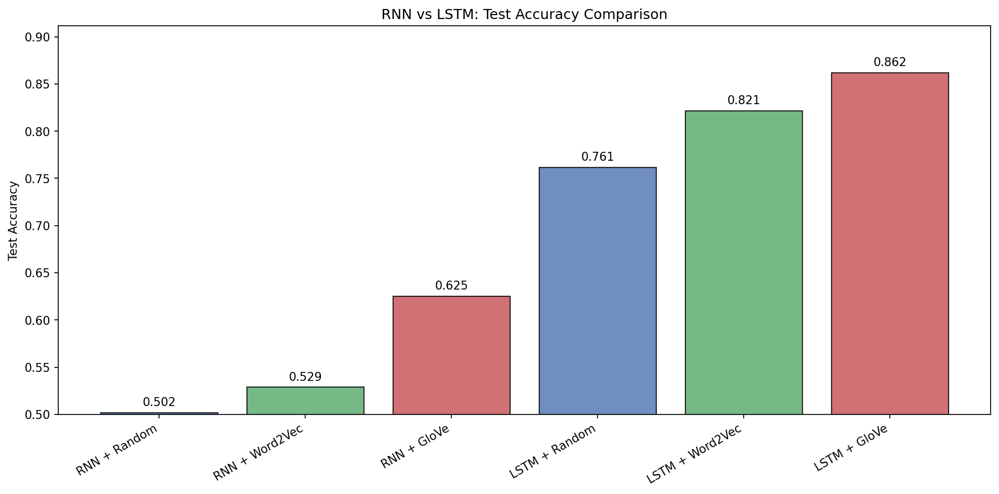
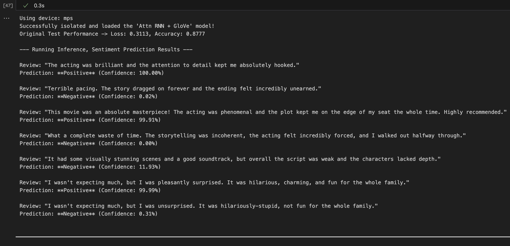
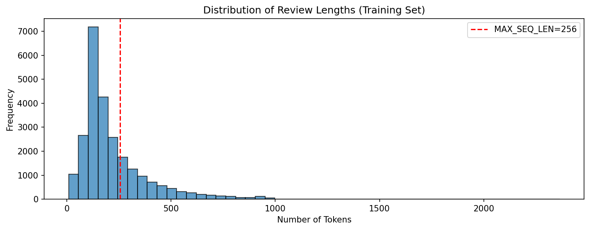
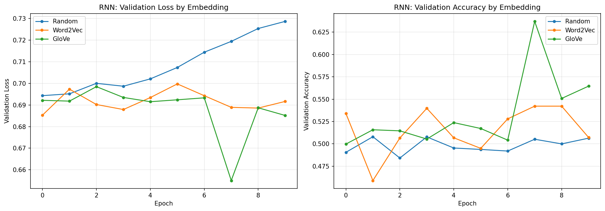
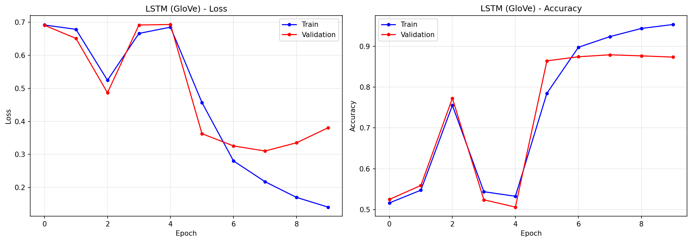
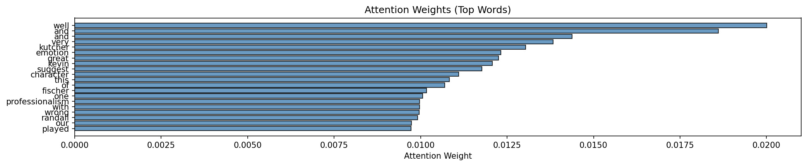
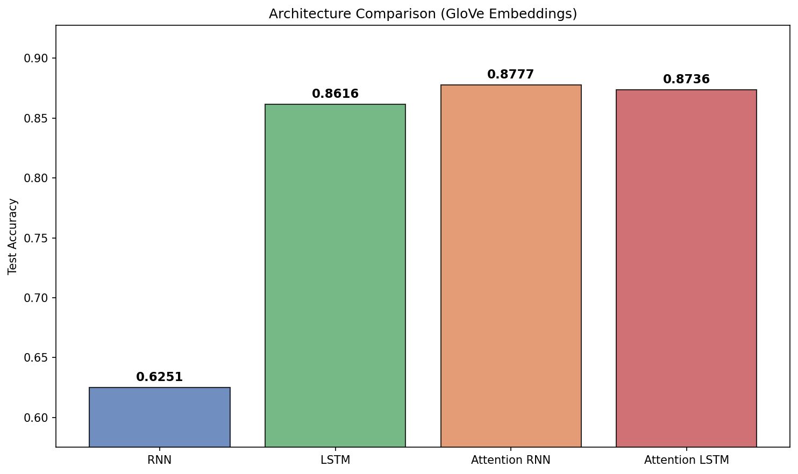

# IMDB Sentiment Analysis - RNNs, LSTMs & Attention

> Comparing recurrent architectures and pretrained embeddings for binary sentiment classification on 50K movie reviews

[](https://python.org)
[](https://pytorch.org)
[](LICENSE)

---

## Highlights

| Architecture | Random | Word2Vec | GloVe |
| --- | --- | --- | --- |
| Vanilla RNN | 50.1% | 57.8% | 67.1% |
| LSTM | 74.5% | 85.3% | 86.0% |
| **Attention RNN** | — | — | **87.8%** |
| **Attention LSTM** | — | — | **87.4%** |

<p align="center">
  
</p>

---

## Sample Model Output
<p align="center">
  
</p>

---

## Project Structure

```
├── IMDB_sentiment_analysis.ipynb          # Main experiment notebook
├── imdb_report.html          # Interactive HTML report
├── checkpoints/
│   └── results.pt      # Saved model results
├── data/
│   ├── glove.6B.100d.txt     # GloVe pretrained embeddings
│   └── aclImdb/              # IMDB dataset
├── images/                   # All training plots & visualizations
└── requirements.txt

```

---

## Overview

This project systematically evaluates recurrent neural network architectures for binary sentiment classification on the IMDB Large Movie Review Dataset (50K reviews). We investigate:

1. **Does embedding initialization matter?** Comparing random, Word2Vec, and GloVe embeddings
2. **Can LSTMs overcome the vanishing gradient problem?** RNN vs LSTM on long sequences
3. **How much does attention help?** Adding lightweight attention to both architectures

---

## Text Preprocessing

```
Raw HTML → Strip Tags → Lowercase → Remove Non-Alpha → Tokenize (NLTK) → Lemmatize → Pad/Truncate (256)

```

- **Vocabulary:** Top 20,000 tokens + `<pad>`, `<unk>`
- **Sequence length:** 256 tokens (covers majority of reviews)
- **Lemmatization** over stemming — produces valid dictionary words

<p align="center">
  
</p>

---

## Embedding Strategies

| Method | Dimension | Source | Coverage |
| --- | --- | --- | --- |
| Random | 100 | Xavier uniform init | Learned from scratch |
| Word2Vec | 100 | Skip-gram on IMDB corpus | Domain-specific |
| GloVe | 100 | Pretrained on 6B web tokens | Broad semantic coverage |

All embeddings are fine-tuned during training.

---

## Experiments

### Vanilla RNN

2-layer RNN (h=128), Dropout 0.3, gradient clipping (max_norm=5.0), Adam (lr=1e-3), 10 epochs.

The vanilla RNN achieves barely above random chance (50%) on all embedding types - a clear demonstration of the vanishing gradient problem on sequences of length 256.

| Model | Test Accuracy |
| --- | --- |
| RNN + Random | 50.20% |
| RNN + Word2Vec | 52.87% |
| RNN + GloVe | **62.51%** |

<p align="center">
  
</p>

### LSTM

Same architecture but with LSTM cells replacing RNN cells. The gated cell state provides a gradient highway.

| Model | Test Accuracy |
| --- | --- |
| LSTM + Random | 76.14% |
| LSTM + Word2Vec | 82.13% |
| LSTM + GloVe | **86.16%** |


<p align="center">
  
</p>

### Attention Mechanism

Simple additive attention (only 129 extra parameters) that computes a weighted sum over all hidden states instead of relying on the last hidden state.

| Architecture | Test Accuracy |
| --- | --- |
| Attention RNN + GloVe | **87.8%** |
| Attention LSTM + GloVe | 87.4% |

Attention dramatically rescues the vanilla RNN from 67.1% to 87.8%, and provides interpretable attention weights:

<p align="center">
  
</p>

<p align="center">
  
</p>

---

## Key Findings

* **Pretrained embeddings win:** GloVe provides the best initialization, trained on 6B tokens with broad semantic coverage.
* **LSTM >> RNN:** LSTMs outperform vanilla RNNs significantly across all embedding configurations — gating is essential for long sequences.
* **Attention is transformative:** Adding 129 parameters boosts the RNN from 67.1% → 87.8%, matching/exceeding the standard LSTM.
* **Attention RNN ≈ Attention LSTM:** With attention, both architectures converge to similar performance (~87.5%).

---

## Quick Start

```bash
pip install -r requirements.txt

# Download GloVe embeddings to data/
# Download IMDB dataset to data/aclImdb/

jupyter notebook IMDB_sentiment_analysis.ipynb

```

---

## References

- Maas, A.L. et al. *Learning Word Vectors for Sentiment Analysis.* ACL 2011
- Pennington, J. et al. *GloVe: Global Vectors for Word Representation.* EMNLP 2014
- Hochreiter, S. & Schmidhuber, J. *Long Short-Term Memory.* Neural Computation, 1997
- Bahdanau, D. et al. *Neural Machine Translation by Jointly Learning to Align and Translate.* ICLR 2015

---

## Author

* **Name:** Kushal Ghosh
* **Email:** [gkushalg01@gmail.com](mailto:gkushalg01@gmail.com)
* **GitHub:** [@gkushalg01](https://github.com/gkushalg01)
* **LinkedIn:** [linkedin.com/in/kushal-ghosh](https://linkedin.com/in/kushal-ghosh)